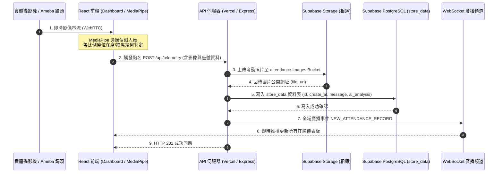

# 📷 ClassVision (Zoe Attendance) - 智慧課堂相機考勤與多座位佔用分析系統

[](https://react.dev/)
[](https://vitejs.dev/)
[](https://developers.google.com/mediapipe)
[](https://supabase.com/)
[](https://vercel.com/)
[](LICENSE)

**ClassVision (Zoe Attendance)** 是一款專為現代教學與會議場景設計的**全棧智慧考勤與多座位佔用分析系統**。結合 **MediaPipe 邊緣即時人員偵測**、**鏡頭等比視覺化劃位編輯器**、**Supabase 雲端資料庫/相簿** 以及 **WebSocket 即時推播**，達成隱私安全、無感且精準的智慧座位點名與出席分析。

---

## 💡 系統運作原理與架構 (Architecture & Workflow)

本系統採用**邊緣計算 (Edge Computing)**、**事件驅動 (Event-Driven)** 與 **雙通道通訊 (HTTP REST API + WebSocket)** 架構：

1. **邊緣視訊擷取與 AI 偵測 (Edge AI Detection Layer)**：
   - 瀏覽器端直接透過 WebRTC 連接實體鏡頭 / Ameba 網路相機。
   - 透過本機 **MediaPipe Tasks Vision** 模型即時偵測視野內人員軀幹核心位置，畫面數據無需上傳至第三方 AI 雲端，兼顧極致隱私安全與毫秒級流暢度。
2. **幾何映射與一人一座精準判定 (Precision Spatial Engine)**：
   - 將現場鏡頭畫面等比例映射至畫布座位百分比坐標（ROI）。
   - 透過幾何中心錨定與唯一性匹配，即時在視訊畫面上以 🟢 綠色（在座）與 ❌ 紅色虛線（缺席）框標註座號與出席狀態。
3. **雲端儲存與持久化 (Supabase Storage & PostgreSQL)**：
   - 觸發點名通報時，影像與考勤結構化資料（課堂節次、總座位數、在座/缺席清單、在座率）透過 `/api/telemetry` 傳送至後端。
   - 影像儲存至 Supabase Storage（`attendance-images` / `attendance_images` Bucket），考勤紀錄寫入 PostgreSQL `store_data` 資料表。
4. **即時廣播與歷史回溯 (Realtime WebSocket & 0ms Cache)**：
   - 後端即時廣播 `NEW_ATTENDANCE_RECORD` 事件至所有線上前端客戶端。
   - 歷史紀錄簿提供 **0ms 本地快取秒開** 與 **一鍵匯出 CSV 報表**。



---

## 🌟 六大核心功能亮點 (Key Features)

### 1. 智慧即時考勤儀表板 (Live Dashboard)
* **等比例鏡頭縮放 (Aspect-Locked View)**：畫布視窗自適應鎖定相機真實長寬比，徹底杜絕畫面變形或劃位偏差。
* **即時 AI 人員視覺化框選**：Canvas 即時覆蓋繪製座位狀態（🟢 在座 / ❌ 未到），並標註座號 ID 與人員邊界框。
* **課堂即時統計卡片**：即時呈現「課堂總座位」、「在座人數」、「未到人數」、「出席率 (%)」與「最後通報時間」。
* **相機容錯與自癒機制**：支援多相機下拉切換、Constraints 自動降級（`exact -> soft -> generic`）、視訊軌道中斷自動喚醒與分頁恢復焦點自動重播。

### 2. 視覺化座位劃位與課堂設置 (Seat Map Editor)
* **全域 Portal 覆蓋 (zIndex: 999999)**：提供沉浸式劃位編輯體驗，無相機畫面時具備安全鎖定提示。
* **自訂數值網格生成**：
  * 自由輸入「排數 (Rows)」×「每排席數 (Cols)」，即時動態計算席次總數。
  * 提供 `2×2`、`2×3`、`3×3`、`4×5`、`5×6` 常用規格一鍵快速排版。
  * 座號全面採用直覺的純數字流水編號（`1`, `2`, `3`...）。
* **座位框自由調整 (Drag Move & 4-Corner Resize)**：
  * **點選拖曳平移 (Drag Move)**：點選座位框即可在畫布上自由拖曳移動位置，具備 0%~100% 邊界自動保護。
  * **4 角落縮放把手 (Resize Handles)**：選取座位後於 4 個角落呈現高對比控制點，支援拉伸放大或縮小。
* **課堂節次彈性設定**：提供第 1~8 節快速標籤切換與自訂節次名稱，點名通報自動格式化為「`8月22日 第 1 節`」。

### 3. 課堂歷史紀錄簿 (History Log)
* **0ms 本地快取秒開 (Instant Cache Load)**：點選歷史紀錄簿瞬間由快取直接渲染卡片，切換零延遲、零空白，並於背景靜默同步最新資料。
* **Shimmer 動態骨架屏 (Skeleton Loading)**：在無快取初次載入時呈現精緻脈衝骨架卡片，提供流暢的視覺反饋。
* **缺席座號醒目標記**：每張歷史紀錄卡片醒目標記未到座號清單（如 `❌ 03`、`❌ 07`）。
* **一鍵匯出 CSV 出席報表**：自動產出包含 UUID、課堂節次、時間、在座數、缺席數、在座率、在座座號清單、未到座號清單與照片網址的完整報表。
* **全螢幕高清照片 Lightbox**：點擊卡片照片即可開啟大圖檢視，查看現場原始拍攝照片。

### 4. 隱私優先架構 (Privacy by Design)
* **無人臉特徵外洩**：僅利用 MediaPipe 進行現場人體/軀幹存在性偵測，無須採集任何生物特徵與個人隱私資料。
* **一人一座唯一性物理匹配**：透過精確幾何中心算法排除相鄰座位誤判與走道擦碰。

### 5. Supabase 一鍵自動建表與擴充系統 (Database Self-Healing)
* **完全冪等性 (Idempotent)**：提供 [supabase_schema.sql](file:///d:/Users/FocalSalt/Documents/GitHub/zoe-attendance/supabase_schema.sql)，可重複執行自動建構資料表、自動擴充 `ai_analysis (JSONB)` 欄位與降序索引。
* **自動初始化 CLI 腳本**：提供 `npm run db:init`，自動驗證連線並建立 Storage 雲端相簿儲存桶。
* **後端多表多儲存桶自動候選與 Base64 容錯備援**：後端具備自動備援機制，Storage 異常時自動降級 Base64 寫入，確保 100% 考勤資料零遺失。

### 6. 現代化雙通道通訊 (REST API + WebSocket)
* 支援 Vercel Serverless Function 與 Express 雙重部署架構。
* 整合全域 WebSocket 推播，點名通報秒級更新所有在線客戶端。

---

## 📁 專案目錄結構 (Project Directory)

```
zoe-attendance/
├── Attendance/                   # ClassVision React 19 + Vite 前端與 API
│   ├── api/                      # Vercel Serverless Function 後端端點
│   │   ├── _lib/
│   │   │   ├── storageService.js # Supabase Storage 圖片上傳服務
│   │   │   ├── supabaseClient.js # Supabase 連線客戶端
│   │   │   └── visionService.js  # 佔用分析與多座位統計服務
│   │   └── index.js              # /api/telemetry 與 /api/history 路由
│   ├── scripts/
│   │   └── init_supabase.js      # Supabase 一鍵自動初始化與驗證腳本
│   ├── src/
│   │   ├── components/
│   │   │   ├── CameraSimulatorModal.jsx # 相機打卡測試模擬器
│   │   │   ├── ImageModal.jsx           # 高清照片 Lightbox 檢視彈窗
│   │   │   ├── SeatMapEditorModal.jsx   # 視覺化劃位與自訂網格編輯器
│   │   │   └── Sidebar.jsx              # 側邊導覽列 (0ms 即時切換)
│   │   ├── pages/
│   │   │   ├── Dashboard.jsx            # 智慧即時考勤儀表板
│   │   │   └── History.jsx              # 課堂歷史紀錄簿 (快取秒開+骨架屏)
│   │   ├── services/
│   │   │   ├── api.js                   # REST API 與 WebSocket 連線模組
│   │   │   └── seatOccupancyService.js  # 座位網格計算與高精度佔用引擎
│   │   ├── App.jsx                      # 主應用路由配置
│   │   ├── index.css                    # 現代玻璃擬態 (Glassmorphism) 設計
│   │   └── main.jsx                     # 應用程式進入點
│   ├── .env.example              # 前端與 API 環境變數範本
│   ├── package.json              # 專案依賴與指令 (含 db:init)
│   ├── vercel.json               # Vercel SPA 路由重寫規則
│   └── vite.config.js            # Vite 建置配置
│
├── .env.example                  # 全域環境變數範本
├── CHANGELOG.md                  # 專案版本變更日誌
├── supabase_schema.sql           # Supabase 一鍵自動建表與擴充 SQL 腳本
└── README.md                     # 專案說明文件 (本文件)
```

---

## 🚀 快速開始指南 (Getting Started)

### 1. 環境需求
* **Node.js**: v18.0.0 以上 (建議 v20+)
* **Supabase 帳號與專案**

---

### 2. 環境變數設定 (`.env`)

複製 `.env.example` 建立 `.env` 檔案：

```bash
# 於專案根目錄或 Attendance 目錄下複製
cp .env.example .env
```

開啟 `.env` 填入您的 Supabase 專案憑證：

```env
# Supabase 專案 URL 與 API 金鑰 (必填)
SUPABASE_URL=https://your-supabase-project-id.supabase.co
SUPABASE_SERVICE_ROLE_KEY=your-supabase-service-role-key
SUPABASE_ANON_KEY=your-supabase-anon-key

# API 與 WebSocket 連線端點 (選填，使用預設或雲端端點)
VITE_API_BASE_URL=
VITE_WS_URL=wss://attendance-backend-p1pj.onrender.com
PORT=5000
```

---

### 3. Supabase 資料庫一鍵建表與擴充

#### 方式 A：透過 Supabase 控制台 (推薦)
至 [Supabase 控制台](https://supabase.com/dashboard) 進入您的專案，點選左側選單的 **SQL Editor**，貼上專案根目錄的 [supabase_schema.sql](file:///d:/Users/FocalSalt/Documents/GitHub/zoe-attendance/supabase_schema.sql) 內容並點擊 **Run** 即可：

```sql
-- 1. 建立 store_data 歷史資料表
CREATE TABLE IF NOT EXISTS store_data (
    id UUID PRIMARY KEY DEFAULT gen_random_uuid(),
    create_at TIMESTAMPTZ DEFAULT NOW(),
    message TEXT NOT NULL,
    file_url TEXT NOT NULL,
    ai_analysis JSONB DEFAULT NULL
);

-- 自動擴充已存在舊表之欄位
ALTER TABLE store_data ADD COLUMN IF NOT EXISTS ai_analysis JSONB DEFAULT NULL;

-- 建立降序查詢索引
CREATE INDEX IF NOT EXISTS idx_store_data_create_at ON store_data(create_at DESC);

-- 2. 建立 Storage 雲端相簿儲存桶
INSERT INTO storage.buckets (id, name, public) 
VALUES ('attendance-images', 'attendance-images', true), ('attendance_images', 'attendance_images', true)
ON CONFLICT (id) DO NOTHING;

-- 3. 設定公開存取安全政策
DO $$
BEGIN
    IF NOT EXISTS (
        SELECT 1 FROM pg_policies 
        WHERE schemaname = 'storage' AND tablename = 'objects' AND policyname = 'Public Read Access for Attendance Images'
    ) THEN
        CREATE POLICY "Public Read Access for Attendance Images" 
        ON storage.objects FOR SELECT 
        USING (bucket_id IN ('attendance-images', 'attendance_images'));
    END IF;
END $$;
```

#### 方式 B：透過 CLI 腳本一鍵初始化
配置好 `.env` 後，直接在 `Attendance` 目錄下執行：

```bash
cd Attendance
npm run db:init
```

---

### 4. 本地啟動與建置

進入 `Attendance` 目錄安裝依賴並啟動開發伺服器：

```bash
cd Attendance
npm install

# 啟動本機開發伺服器 (預設運行於 http://localhost:5173)
npm run dev

# 建置正式生產發布包
npm run build
```

---

## 📡 REST API 端點說明

| HTTP 方法 | 端點路徑 | 說明 | 參數 / 請求體 |
| :--- | :--- | :--- | :--- |
| **POST** | `/api/telemetry` | 接收相機點名通報，上傳相片至 Storage 並存入 DB，觸發 WebSocket 廣播 | `{ message, file, seats, detected_persons }` |
| **GET** | `/api/history` | 查詢歷次課堂考勤紀錄（支援時間降序與關鍵字搜尋） | Query: `limit` (預設 50), `search` |
| **GET** | `/api/health` | 伺服器健康檢查與運作狀態確認 | 無 |

---

## 📜 授權條款 (License)

本專案採用 **MIT License** 授權開源。詳情請參閱 [LICENSE](file:///d:/Users/FocalSalt/Documents/GitHub/zoe-attendance/LICENSE) 檔案。
